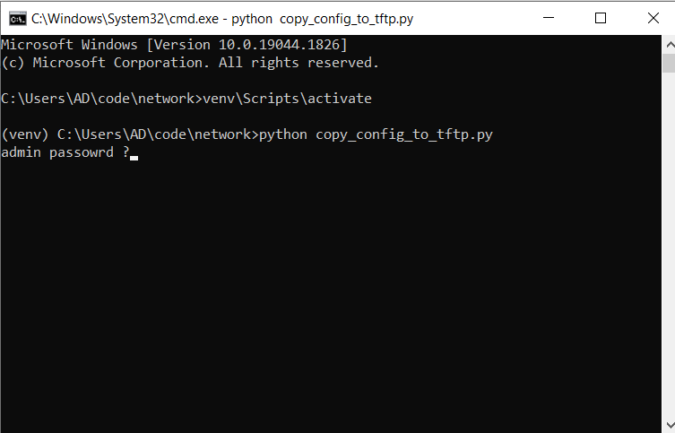

# Network

## Copy running config from list of Arista and Cisco switches to TFTP server

`copy_config_to_tftp.py` coppies running config from a list of Arista and Cisco switches to TFTP server. It also geenrates a output (log) file for each device after running the application. 

To run the application

1. Download and install python. You can find python download website [here](https://www.python.org/downloads/) 
2. Make sure to select "Add Python x.x tp PATH" during the installation.
3. Optional: Create pytohn virtal environment and activate. More information [here](https://docs.python.org/3/tutorial/venv.html)
4. Install python packages form `requirements.txt`

```python
pip install -r requirements.txt 
```

5. run python file `copy_config_to_tftp.py`

```python
python copy_config_to_tftp.py
```

</br>
</br>

### Built With

* Python 3.7.9.
* Netmiko python library

</br>
</br>

## Screenshots
</br>

